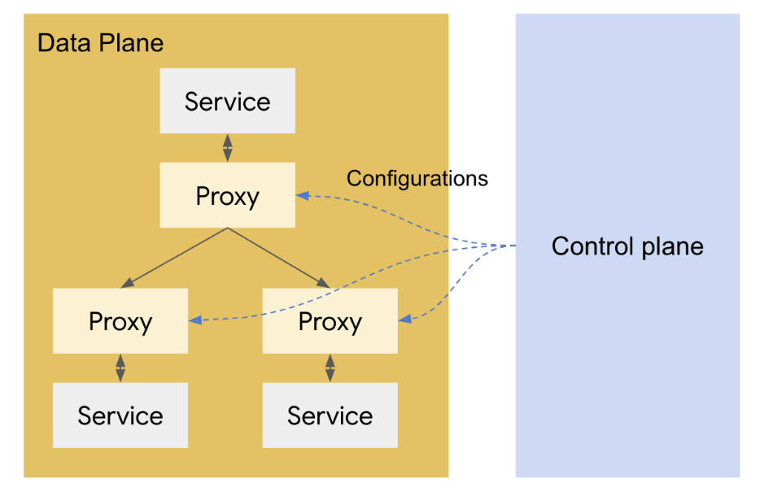

# Istio

공개여부: Yes
작성일자: 2021년 3월 16일
태그: Envoy, Infra, Istio, MSA


# 목차

# Istio



서비스 메쉬 구조로 구성된 MSA환경에서 Data Plane을 컨트롤할 수 있는 솔루션으로 Istio의 경우 Data Plane의 Proxy는 Envoy Proxy로 구성되어 있다

즉, **Istio는 Envoy Proxy를 Data plane으로 사용하고 있고 이를 컨트롤 해주는 오픈소스**이다


## Envoy Proxy

Lyft사에서 개발된 오픈소스로 L4 Proxy 기능뿐 아니라 L7 Proxy 기능도 제공한다

현재 HTTP/1.0, HTTP/2.0, TCP, gRPC등 다양한 프로토콜을 지원

**주요 특성**


### Envoy 배포 아키텍처


- **Front envoy proxy**
    - 전체 시스템 앞의 위치하는 프록시로 클라이언트에서 들어오는 호출을 받아서 각각의 서비스로 라우팅을 해준다
    - Nginx, Apache HTTP Server와 같은 역할

- **Service to service ingress listener**
    - 특정 서비스 앞에 위치하는 배포 방식으로 서비스로 들어오는 트래픽에 대한 처리를 한다
    - 트래픽에 대한 버퍼링이나 Circuit breaker와 같은 역할 수행

- **Service to service egress listener**
    - 특정 서비스 뒤에 위치하는 배포 방식으로 서비스로부터 나가는 트래픽을 통제한다
    - 해당 서비스로부터 호출되는 서비스에 대해 로드밸런싱, 호출 횟수 통제와 같은 기능을 수행

- **External service egress listner**
  
- 외부 서비스로 나가는 트래픽을 관리하는 역할로, 외부 서비스에 대한 Delegator와 같은 역할 수행
  
- *실제 배포 시 하나의 서비스 앞뒤로 두개의 evoy proxy를 배치하지는 않는다*

    

    위와 같이 하나의 서비스에 하나의 envoy를 배치한 후, Ingress/Egress 두가지 용도로 겸용해서 사용한다


### Envoy 설정 구조


Envoy의 설정은 크게 Listener, Filter, Cluster 세 가지 파트로 구성된다

- **Listener**
    - 클라이언트로부터 프로토콜을 받는 부분
- **Filter**
    - Listener로부터 받은 메시지를 중간처리하는 부분으로 압축, 트래픽 제한 등을 거친 뒤 라우터를 통해 적절한 클러스터로 라우팅하는 역할
- **Cluster**
    - 실제로 라이팅이 될 대상 서버(서비스)가 되는 부분


# Istio 구조


## Data plane

- Envoy Proxy를 사이드카 패턴으로 서비스 옆에 붙여 배포를 하여, 서비스로 들어오고 나가는 트래픽을 통제 한다
- Envoy Proxy에서 각 서비스들을 호출할 때는 Control plane의 Pilot이라는 컴포넌트에 접근하여 엔드 포인트를 참고한다(Client side discovery)


## Control plane

### Pilot

- Envoy proxy에 대한 설정 관리를 하는 역할
- 서비스들의 EndPoint들의 주소를 얻을 수 있는 서비스 디스커버리 기능 제공
- 서비스에서 서비스를 호출하는 경로 컨트롤 기능 제공
- Retry, Circuit Breaker, TimeOut 등의 기능 제공

### Mixer

- Access Control, Policy Control
    - 특정 처리량이 넘으면 요청을 못받게 하거나, 특정 헤더값이 일치해야 요청을 받을 수 있는 등의 다양한 정책을 정의하고 컨트롤하는 역할
- 각종 모니터링 지표 수집
    - 서비스의 응답시간이나 평균 처리량 등 다양한 지표를 수집하여 저장하는 역할

### Citadel

- 보안에 관련된 기능을 담당하는 모듈
- 사용자 인증/인가 담당
- TLS(SSL) 암호화 및 사용자 인증에 필요한 인증서 관리


# Istio 기능

## 트래픽 통제

- 트래픽 분할
    - 서로 다른 버전의 서비스를 배포해둔 뒤, 버전별로 트래픽의 양을 조절할 수 있는 기능
    - 네트워크 패킷의 내용을 기반으로 라우팅할 수 있는 기능
        - ex) HTTP 헤더의 User-agent에 따라 클라이언트가 aos일 경우 ios일 경우 다르게 라우팅


## 서비스간 안정성 제공(Resilience)

- 서비스 디스커버리
    - 대상 서비스가 여러개의 인스턴스로 구성되어있으면 로드 밸런싱하여 분배
- 헬스 체크
    - 대상 서비스에 대해서 주기적으로 상태 체크
    - Failure recovery(장애가 난 서비스를 제거후 재생성)
- Retry, Circuit breaker, TimeOut


## 보안

- 통신 보안
    - 기본적으로 envoy를 통해서 통신하는 모든 트래픽을 자동으로 TLS로 암호화
- 서비스 인증과 인가
    - 서비스간 인증 (양방향 TLS 인증)
    - 서비스와 사용자간 인증 (JWT 인증)
    - 인가를 통한 권한 통제 (RBAC)


## 모니터링

Istio는 네트워크 트래픽을 모니터링함으로써 서비스간에 호출 관계가 어떻게 되고, 서비스의 응답 시간, 처리량 등의 다양한 지표를 수집하여 모니터링 할 수 있다


Mixer에서 관련 지표를 수집하는 구조

Mixer는 플러그인이 가능한 Adpater 구조로 되어있어 운영하는 인프라에 맞춰서 로깅 및 모니터링 시스템을 연동할 수 있다


# Spring Cloud System과의 차이점

- API Gateway 구축을 위한 오픈소스 부분

    ➡️  **대체 가능**

- 분산 추적

    ➡️  Mixer에 타 플러그인을 붙여 모니터링이 가능하다

    - **Prometheus**, **Grafana**를 통한 차트형 UI
        - 이미지

            

    - **Kiali**을 통한 그래프 형태의 UI
        - 이미지

            

    - **Jaeger**를 사용하면 서버 내부 프로세싱 추적(어떤 함수에서 얼마나 소요됬고, 얼마나 많이 수행되었나) 가능
    - 등등


# Sample project

참고 사이트 : [https://piotrminkowski.com/2020/06/01/service-mesh-on-kubernetes-with-istio-and-spring-boot/](https://piotrminkowski.com/2020/06/01/service-mesh-on-kubernetes-with-istio-and-spring-boot/)


## Prerequisite

- docker desktop(for windows)
- kubernetes
- Spring boot sample project
    - github([https://github.com/jeff-seyong/istio-springboot](https://github.com/jeff-seyong/istio-springboot))


## Install Istio

```
$ istioctl manifest generate --set profile=demo

$ kubectl label namespace default istio-injection=enabled
```


## Install skaffold

```
> Skaffold 다운로드 : https://storage.googleapis.com/skaffold/builds/latest/skaffold-windows-amd64.exe 

> 저장 후 환경변수 등록
```


## Deployment

```
$ cd caller-service
$ skaffold dev --port-forward

$ cd callme-service
$ skaffold dev --port-forward
```


## Monitering


# 참고 사이트

- [Istio document](https://istio.io/latest/docs/concepts/what-is-istio/)
- [https://bcho.tistory.com/1296?category=731548](https://bcho.tistory.com/1296?category=731548)
- [https://piotrminkowski.com/2018/04/13/service-mesh-with-istio-on-kubernetes-in-5-steps/](https://piotrminkowski.com/2018/04/13/service-mesh-with-istio-on-kubernetes-in-5-steps/)
- [https://piotrminkowski.com/2020/06/01/service-mesh-on-kubernetes-with-istio-and-spring-boot/](https://piotrminkowski.com/2020/06/01/service-mesh-on-kubernetes-with-istio-and-spring-boot/)
- [https://kubernetes.io/ko/docs/concepts/overview/components/](https://kubernetes.io/ko/docs/concepts/overview/components/)
-